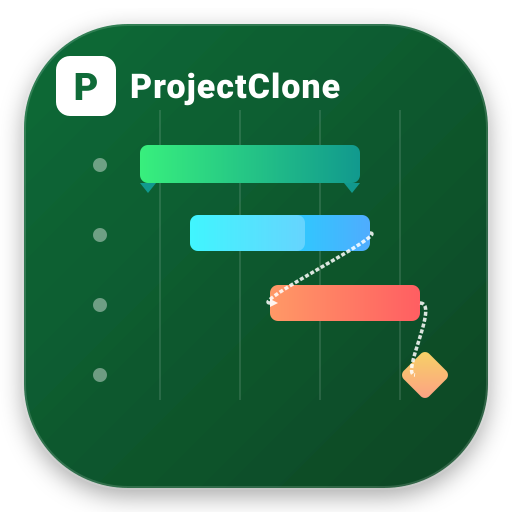

# ProjectClone 🚀
> **O melhor software de gerenciamento de projetos e gráficos de Gantt na web, compatível com o Microsoft Project.**

Desenvolvido com foco em alta performance, usabilidade moderna e engenharia de planejamento robusta. O **ProjectClone** reúne o poder analítico do **Microsoft Project** com a fluidez e elegância das ferramentas ágeis mais avançadas da atualidade.



---

## 🌟 Principais Recursos

- 📊 **Gráfico de Gantt Interativo**:
  - Arrastar e soltar para alterar datas de início e término.
  - Redimensionamento suave de duração puxando pelas extremidades da barra.
  - Ajuste de progresso físico (`0% - 100%`) direto na barra.
  - Zoom dinâmico: **Dias**, **Semanas**, **Meses** e **Trimestres**.
  - Destaque automático de finais de semana e marcador vertical em tempo real para **Hoje**.

- 🌲 **Tabela WBS / EAP (Work Breakdown Structure)**:
  - Edição estilo planilha com duplo clique e suporte completo a teclado.
  - Níveis hierárquicos expansíveis e retráteis (`▶` / `▼`).
  - Funções de **Recuar** (*Indent*) e **Avançar** (*Outdent*) para criar fases e subprocessos com 1 clique.
  - Tarefas-resumo com agregação automática de prazos, progresso ponderado e custos.

- 🔥 **Cálculo de Caminho Crítico (CPM - Critical Path Method)**:
  - Identificação algorítmica de tarefas sem folga que definem a data final do projeto.
  - Destaque visual das barras críticas em vermelho vibrante.

- 🔗 **Dependências Reais e Conexões SVG**:
  - Vínculos: **Término-a-Início (FS)**, **Início-a-Início (SS)**, **Término-a-Término (FF)** e **Início-a-Término (SF)** com suporte a atrasos/adiantamentos (*Lag/Lead*).
  - Desenho vetorial de curvas Bezier inteligentes com setas apontadoras.
  - Criação rápida de dependências arrastando pinos de conexão de uma barra para outra.

- 📌 **Linha de Base (Baseline)**:
  - Salve o planejamento inicial e visualize graficamente eventuais desvios de cronograma (*ghost bars*).

- 📋 **Múltiplos Modos de Trabalho**:
  - 📊 **Gráfico de Gantt**: Visão tradicional e analítica com divisão redimensionável (*split-view*).
  - 📋 **Quadro Kanban Ágil**: Cartões sincronizados em tempo real categorizados em *Backlog*, *A Fazer*, *Em Andamento* e *Concluído*.
  - 👥 **Folha de Recursos & Custos**: Cadastro de equipes, equipamentos, taxas horárias e custos orçados totais.
  - 📈 **Painel Executivo & KPIs**: Métricas de progresso físico, tarefas atrasadas, orçamentos por fase e riscos.
  - 📅 **Calendário Mensal**: Visualização estilo calendário de eventos e entregas.

- 📐 **Interoperabilidade Total**:
  - Importação e Exportação de arquivos XML do **Microsoft Project** (`.xml`).
  - Salvamento completo em arquivo `.projectclone` / `.json`.
  - Exportação de planilhas formatadas para **Excel (CSV)** com suporte a acentuação (BOM UTF-8).
  - Impressão otimizada em **PDF**.

- 💡 **Modelos Profissionais Pré-Configurados**:
  - Construção Civil e Reformas de Edifícios.
  - Desenvolvimento de Software (SaaS / Web App).
  - Lançamento de Produto e Marketing Digital.

- 🌐 **Offline First (PWA) & Internacionalização**:
  - Funciona totalmente offline como Progressive Web App (PWA).
  - Suporte bilíngue instantâneo: **Português (PT-BR)** e **Inglês (EN-US)** com detecção automática do navegador.
  - Alternador de Tema Escuro (*Dark Mode*) e Claro (*Light Mode*).

---

## 💻 Como Executar

O **ProjectClone** é 100% autônomo, não dependendo de compilação ou frameworks pesados. Pode ser executado em qualquer servidor web com Apache/Nginx ou PHP embutido:

```bash
cd /caminho/do/projeto
php -S localhost:8000
```
Acesse `http://localhost:8000` no seu navegador favorito.

---

## 📄 Licença
Distribuído sob licença aberta pelo laboratório [4u-Labs](https://github.com/4u-Labs).
